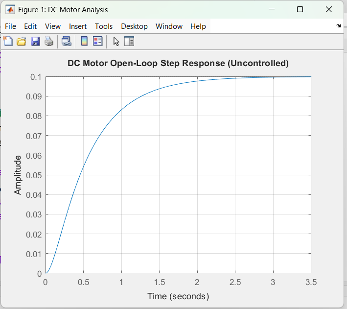
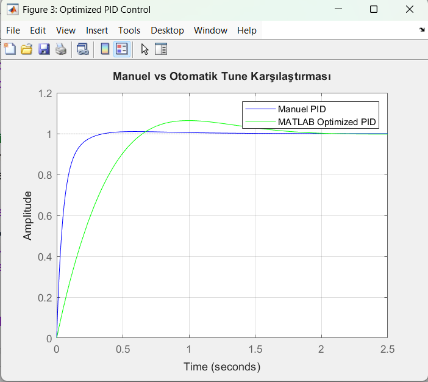

# 🏎️ DC Motor Speed Control & PID Optimization

This project demonstrates the mathematical modeling and control of a DC motor using MATLAB. It focuses on designing a PID controller to transform a sluggish, uncontrolled system into a precise and fast-response control loop.

## 📌 Project Overview
In industrial automation, precise speed control is critical. This project models a DC motor's physical characteristics and implements a Proportional-Integral-Derivative (PID) controller to achieve zero steady-state error and optimal settling time.

## 🧮 Mathematical Modeling
The motor is represented by a second-order continuous-time transfer function:

$$G(s) = \frac{\Omega(s)}{V(s)} = \frac{0.01}{0.005s^2 + 0.06s + 0.1001}$$

* **Input**: Voltage (V)
* **Output**: Angular Velocity (rad/s)

## 📊 Performance Analysis
The control strategy successfully addressed the following system limitations:
* **Error Reduction**: The uncontrolled system had a steady-state error of nearly 90%. The PID controller eliminated this error entirely.
* **Speed Optimization**: Settling time was reduced from several seconds to less than **0.5 seconds**.
* **Stability**: Achieved a smooth response with minimal overshoot, protecting mechanical components.

## 🖼️ Visual Results
Below is the comparison of different control states:

* **Red**: Uncontrolled system showing high error.
* **Blue**: Manually tuned PID ($K_p=100, K_i=200, K_d=10$) providing the fastest response.
* **Green**: MATLAB automated tuning for a balanced, conservative response.

## 📈 Project Evolution

### 1. Baseline Performance (Uncontrolled)

*The open-loop response shows a significant steady-state error and slow rise time.*

### 2. PID Control Impact

*The blue line demonstrates how the PID controller eliminates error and drastically improves response speed.*

### 3. Tuning & Optimization

*Comparison between manual tuning and MATLAB's auto-tuner, showcasing optimized transient response.*

## 🚀 How to Run
1.  Open MATLAB.
2.  Run the `dc_motor_pid_control.m` script.
3.  The performance plots will be generated automatically.

---
*Developed as a personal engineering project to showcase control systems expertise.*
